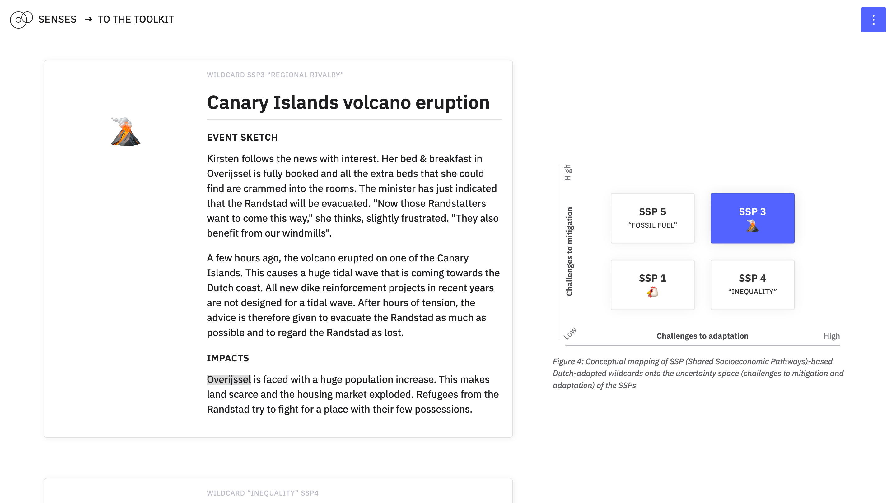

# Co-producing robust adaptation pathways to address adaptation and mitigation to climate change

Lotte de Jong, Simona Pedde, Kasper Kok and Jonas Parnow

The Dutch case study area, the Overijsselse Vecht, is an intensely managed area and has a long history of participatory management and cooperation between public and private sector stakeholders and scientists. The fields of interest in the Overijsselse Vecht include water management, (sustainable) agricultural development and climate change adaptation. For these reasons, the Dutch case study is an example of an [information-rich context](https://climatescenarios.org/co-production/#dutch). We link the local, bottom-up and empirical knowledge with top-down scientific input translated from global socioeconomic and climate impact scenarios, developed from the [Shared Socioeconomic Pathways](https://climatescenarios.org/primer/socioeconomic-development) using co-production techniques with stakeholders. The aim is to develop pathways for a climate robust and CO2-neutral Overijsselse Vecht, while linking climate adaptation and mitigation. In this page, adaptation scenarios are referred to as "pathways" because we design a "path" in coherent steps in time towards a sustainability goal that we call "vision".

In this page, we demonstrate in three interactive parts how the development adaptation pathways can benefit from the use of co-production techniques and global scenarios information For a full background of the case study we refer to the [SENSES Deliverable](http://senses-project.org/results/).

---

This repository contains the code for [*Co-producing robust adaptation pathways to address adaptation and mitigation to climate change*](https://climatescenarios.org/dutch/). It is part of the [SENSES Toolkit](https://climatescenarios.org/).




## License

The source code is licensed under the [ISC license](LICENSE.md). Text and graphics are licensed under [Attribution-ShareAlike 4.0 International](https://creativecommons.org/licenses/by-sa/4.0/). For licensing information on datasets please refer to the data sources section. Exceptions are listed below on a per-file basis.

## Build Setup

```bash
# install dependencies
$ npm install

# serve with hot reload at localhost:3000
$ npm run dev

# build for production and launch server
$ npm run build
$ npm run start

# generate static project
$ npm run generate
```

For detailed explanation on how things work, check out [Nuxt.js docs](https://nuxtjs.org).
